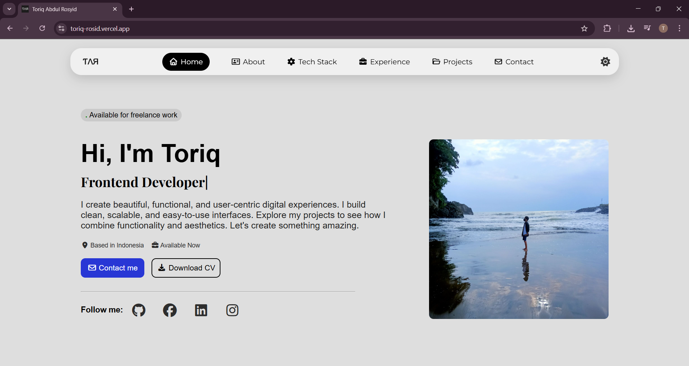

# 🌐 Personal Portfolio Website

This is my **personal portfolio website**, built to showcase my skills, projects, and experience as a **Fullstack Software Engineer**.  
The website features a modern, responsive design with a smooth dark mode toggle and clean animations for a better user experience.

---

## 🚀 Features

- 🎨 **Responsive Design** – Works smoothly on desktop, tablet, and mobile.
- 🌙 **Dark/Light Mode Toggle** – Saves user preference using `localStorage`.
- ⚡ **Smooth Animations** – Elements reveal with transitions and scroll effects.
- 🧩 **Reusable Components** – Organized structure for scalability and clarity.
- 📂 **Project & Tech Stack Sections** – Displays experience and technology proficiency.
- 💬 **Contact Form** – Includes contact section and social media links.

---

## 🧱 Project Structure

```bash
📁 Portofolio
│
├── 📁 images/ # All images and icons used in the website
├── 📄 index.html # Main HTML structure
├── 📄 style.css # Styling and responsive design
└── 📄 main.js # JavaScript for dark mode, animations, and interactivity

```
---

## 🛠️ Built With

- **HTML5** – Page structure  
- **CSS3** – Styling and responsive layout  
- **JavaScript (Vanilla)** – Dynamic interactions (Dark mode, animations)  
- **Font Awesome** – Icon library for UI elements  

---

## ⚙️ Setup Instructions

To run this project locally:

```bash
# Clone the repository
git clone https://github.com/toriqkun/Portofolio.git

# Navigate into the project folder
cd portofolio

# Open the website in your browser
open index.html
# or manually drag index.html into your browser
```

---

## 🌗 Dark Mode Logic
- Dark mode is implemented using a simple toggle that:
- Switches the body class between dark and light.
- Updates icons dynamically (fa-sun ↔ fa-moon).
- Changes the logo and UI colors accordingly.
- Persists the theme preference in localStorage.

---

<div align="center">
  
</div>

---

## 🧑‍💻 Author
Toriqkun
Fullstack Developer passionate about building elegant, responsive, and efficient web applications.

- 💼 toriqkun
- 📧 toriqkun25@gmail.com
- 🌐 https://toriq-rosid.vercel.app/

---
